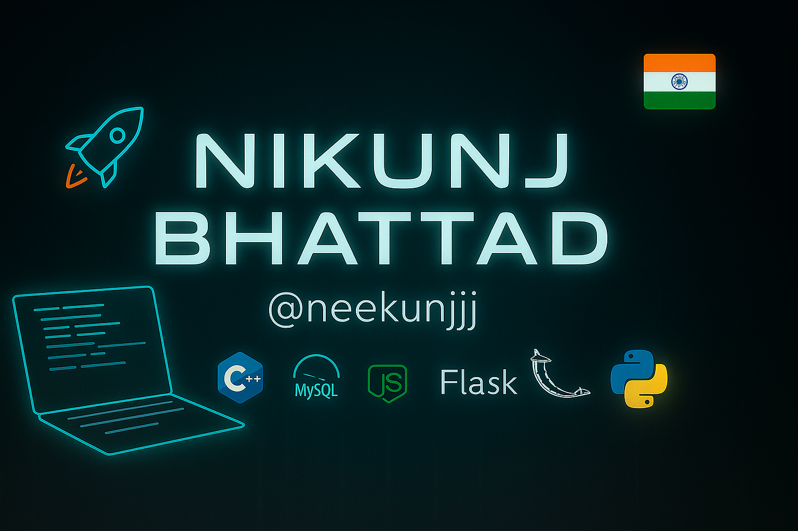

# nikunjbhattad
# 👋 Hi there, I'm Nikunj Bhattad!

🎓 B.Tech IT Student @ Vishwakarma Institute of Technology, Pune (2027)  
💡 Passionate about software development, computer vision, and using tech to solve real-world problems  
🌱 Currently learning: Docker, Kubernetes, and Data Structures  
📫 Reach me at: [nikunj.bhattad23@vit.edu](mailto:nikunj.bhattad23@vit.edu)

---

## 🔧 Tech Stack

---

## 🧠 Projects
Here are a few cool projects I've worked on:

### 📌 [Unusual Activity Detection in Classrooms](#)
> Detects suspicious behavior using computer vision & OpenCV with custom-trained datasets.

### 📌 [Fight Detection System](#)
> Identifies aggressive gestures in classrooms using video analysis to enhance student safety.

### 📌 [Divine Locator App](#)
> Mobile app that helps users locate nearby spiritual and religious landmarks using GPS.

### 📌 [Evening Student Management System](#)
> A role-based web system that streamlines operations for evening courses and classes.

---

## 🏆 Experience & Involvement
- 👨‍💻 **Java Intern** @ Orangebits Software Technologies – Managed project timelines and deliverables.
- 🌍 **Group Leader Intern** @ Axis My India – Led social research surveys for policy planning.
- ⚽ **Volunteer** @ EPEC VIT – Coordinated 25+ college sports events.

---

## 📈 GitHub Stats

  
   
  
   
  

---

## 🌐 Connect with Me

---

> ⚽ Chess enthusiast | 🎵 Bollywood music lover | 🍳 Enjoys cooking | 🏸 Loves badminton
